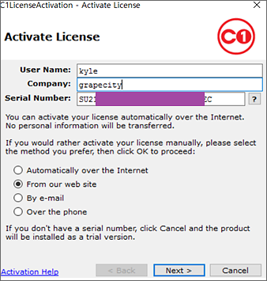
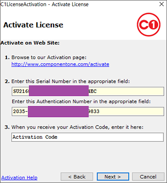
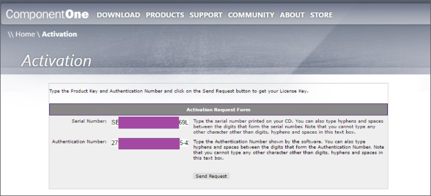
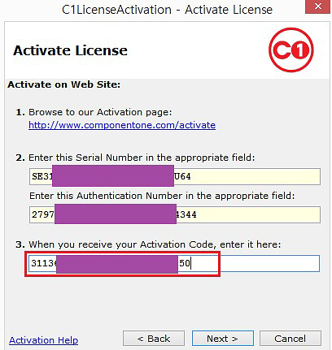
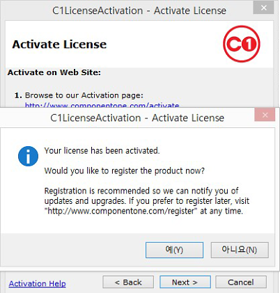

## 오프라인 라이선스 인증 (Activation)

1. 정품 인증 프로그램은 **ComponentOne**시작 메뉴에 등록 된 제품 그룹
   "**c:\Windows\ProgramFiles(x86)\ComponentOne\C1StartMenu**"에서 "**C1LicenseActivation**"을 클릭합니다.

   

2. 이름, 회사명, 시리얼번호를 입력하고 "**From Our web site**"를 선택한 후 "**Next**" 버튼을 클릭합니다.

   

3. **Sereial Number**와 **Authentication Number**를 기록해두세요.

   

4. 인터넷이 연결된 PC또는 모바일에서 [http://www.componentone.com/Activate](http://www.componentone.com/Activate) 사이트에서 기록해두었던 **Sereial Number**와 **Authentication Number**을 아래의 방법대로 입력하고 "**Send Request**"버튼을 클릭합니다.

   

5. 아래의 Activation Code를 기록해둡니다.

   

6. C1LicenseActivation 창에서 Activation Code를 입력한 후 "Next"버튼을 클릭합니다.

   

7. "예[Y]"버튼을 클릭하여 인증을 완료합니다.

   

## 오프라인 라이선스 해제 (Deactivation)

인터넷이 연결된 PC또는 모바일에서 [http://www.componentone.com/Deactivate](http://www.componentone.com/Deactivate)사이트에 들어갑니다.  
 보관해 둔 Serial Number와 Authentication Number와 기타 내용을 입력 후 “Submit Request” 버튼을 클릭하여 Deactivation과정을 완료 합니다. (Serial Number와 Authentication Number는 오프라인 상태에서 인증을 할 때 알 수 있습니다.)

  

