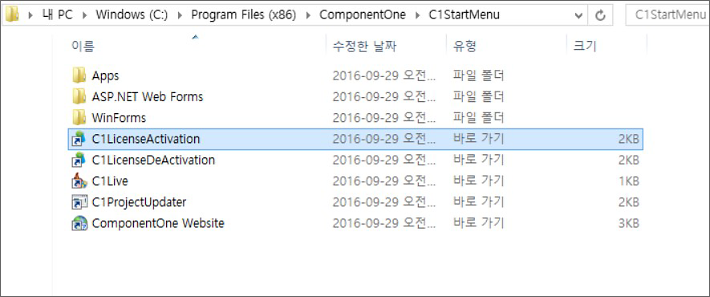
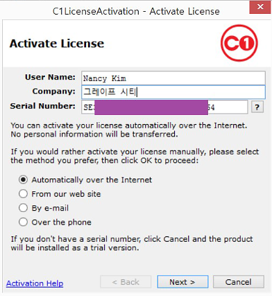
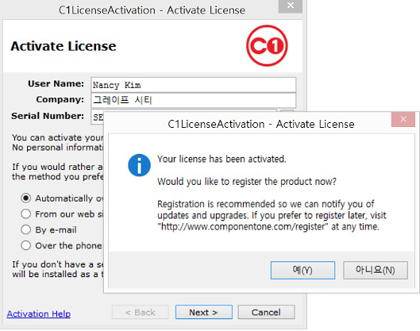

## 온라인 라이선스 인증 (Activation)

1. 정품 인증 프로그램은 **ComponentOne**시작 메뉴에 등록 된 제품 그룹
   "**c:\Windows\ProgramFiles(x86)\ComponentOne\C1StartMenu**"에서 "**C1LicenseActivation**"을 클릭합니다.

   

2. 정품 인증은 사용자 이름, 회사 이름, 일련 번호를 입력한 후 "Next"버튼을 클릭합니다.  
   (옵션은 기본적으로 선택되어 있는 첫 번째 "Automatically over the internet"으로 설치를 진행합니다.)

   

3. 아래와 같이 액티베이션이 완료 되었습니다. 이후 발생하는 팝업창은 그냥 닫으셔도 액티베이션과는 아무 상관 없으나 "예[Y]"버튼을 클릭하시면 미국 지사의 홈페이지로 연결합니다.
   원하지 않으시면 "아니오[N]"를 클릭하시거나 또는 그냥 창을 닫아 주시기 바랍니다.

   

## 온라인 라이선스 해제 (Deactivation)

1. 정품 인증 프로그램은 ComponentOne시작 메뉴에 등록 된 제품 그룹 "c:\Windows\Program Files(x86)\ComponentOne\C1StartMenu"에서 "C1LicenseDeActivation"을 클릭합니다.
   

2. 중간에 “?”버튼을 클릭하여 정품 인증 해제할 제품 시리얼 번호를 선택한 후 “Next” 버튼을 클릭합니다.
   

3. “확인”버튼을 클릭하여 정품 인증 해제 작업을 완료합니다.
   

시리얼 넘버는 사용자 하드웨어의 손-망실을 대비하여 한 개에 총 3회까지 활성화를 허용하고 있습니다. 활성화 횟수를 초과하여 어려움을 겪지 않도록 주의 바랍니다.
